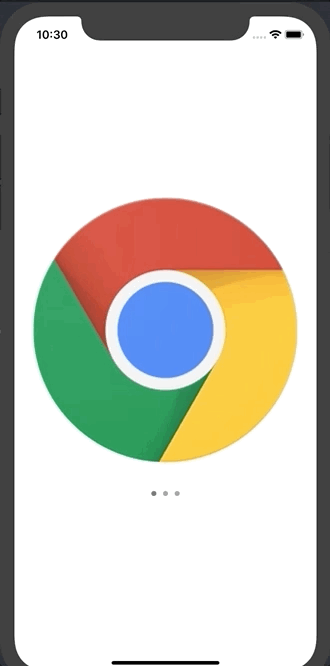

# DLAutoSlidePageViewController

[](https://cocoapods.org/pods/DLAutoSlidePageViewController)
[](https://cocoapods.org/pods/DLAutoSlidePageViewController)
[](https://cocoapods.org/pods/DLAutoSlidePageViewController)
[](https://developer.apple.com/swift/)

## Demo



## Example

To run the example project, clone the repo, and run `pod install` from the Example directory first.

## Requirements

DLAutoSlidePageViewController requires iOS 13.0 and Swift 5.0 or above.

## Installation

### CocoaPods

PageViewController is available through [CocoaPods](http://cocoapods.org). To install
it, simply add the following line to your Podfile:

```ruby
pod "DLAutoSlidePageViewController"
```

### Swift Package Manager

To integrate using [Swift Package Manager](https://swift.org/package-manager/), add the following as a dependency to your Package.swift:

```Swift
.package(url: "https://github.com/DeluxeAlonso/DLAutoSlidePageViewController.git", .upToNextMajor(from: "3.0.0"))
```

## Usage

Create an instance of `DLAutoSlidePageViewController` and provide it with an array of `UIViewController`'s.

```swift
let firstVC = storyboard?.instantiateViewController(withIdentifier: 'FirstVC')
let secondVC = storyboard?.instantiateViewController(withIdentifier: 'SecondVC')
let pages = [firstVC, secondVC]

let pageViewController = DLAutoSlidePageViewController(pages: pages)
                                                       
addChildViewController(pageViewController)
containerView.addSubview(pageViewController.view)
pageViewController.view.frame = containerView.bounds
```

## Appearance and presentation configuration

There are two ways to configure the appearance and presentation of `DLAutoSlidePageViewController`:

1) You can do it globally using the `DefaultAutoSlideConfiguration` class before instantiation.

```swift
let pages = [firstVC, secondVC]

DefaultAutoSlideConfiguration.shared.timeInterval = 5.0
DefaultAutoSlideConfiguration.shared.interPageSpacing = 3.0
DefaultAutoSlideConfiguration.shared.hidePageControl = false
let pageViewController = DLAutoSlidePageViewController(pages: pages)
```

2) You can create your own configuration instance that conforms to `AutoSlideConfiguration` protocol and pass it on `DLAutoSlidePageViewController`'s initializer.

```swift
struct CustomConfiguration: AutoSlideConfiguration {
    var timeInterval: TimeInterval = 10.0
    var navigationOrientation: UIPageViewController.NavigationOrientation = .vertical
}
```

```swift
let pages = [firstVC, secondVC]
let pageViewController = DLAutoSlidePageViewController(pages: pages, configuration: CustomConfiguration())
```

## Available configuration properties

`DLAutoSlidePageViewController` can be customized via the following properties:

| Property   |      Type      | Description |
|:----------:|:-------------:|------|
| timeInterval |  TimeInterval | Time interval to be used for each page automatic transition. |
| transitionStyle | UIPageViewController.TransitionStyle | Styles for the page-turn transition. |
| navigationOrientation | UIPageViewController.NavigationOrientation | Orientations for page-turn transitions. |
| navigationDirection | UIPageViewController.NavigationDirection | Directions for page-turn transitions. |
| interPageSpacing | Float | Space between pages. |
| spineLocation | UIPageViewController.SpineLocation | Locations for the spine. Only valid if the transition style is UIPageViewController.TransitionStyle.pageCurl. |
| hidePageControl | Bool | Decides if page control is going to be shown or not. |
| currentPageIndicatorTintColor | UIColor | The tint color to be used for the current page indicator. |
| pageIndicatorTintColor | UIColor | The tint color to be used for the page indicator. |
| pageControlBackgroundColor | UIColor | The background color to be used for the page control. |
| shouldAnimateTransition | Bool | Indicates whether the automatic transition is to be animated. |
| pageControlDirection | UIPageControl.Direction | Decribes the layout direction of a page control’s indicators. Available since iOS 16. |
| pageControlPreferredIndicatorImage | UIImage | The preferred image for indicators. Symbol images are recommended. Default is nil. Available since iOS 14. |
| pageControlPreferredCurrentPageIndicatorImage | UIImage | The preferred image for the current page indicator. Available since iOS 16. |
| shouldSlideOnTap | Bool | Indicates if the page controller should slide back/forward when the users taps on the left/right side. |
| tappableAreaPercentage | Float | Tappable area percentage used to detect taps on both sides: left and right. Defaults to 20%. Only used if shouldSlideOnTap is set to true. |
| overridesGestureBehavior | Bool | False by default. If set to true DLAutoSlidePageViewControllerGestureDelegate methods will be called if needed and shouldSlideOnTap property will be ignored. |


## Author

Alonso Alvarez, alonso.alvarez.dev@gmail.com

## License

DLAutoSlidePageViewController is available under the MIT license. See the LICENSE file for more info.
